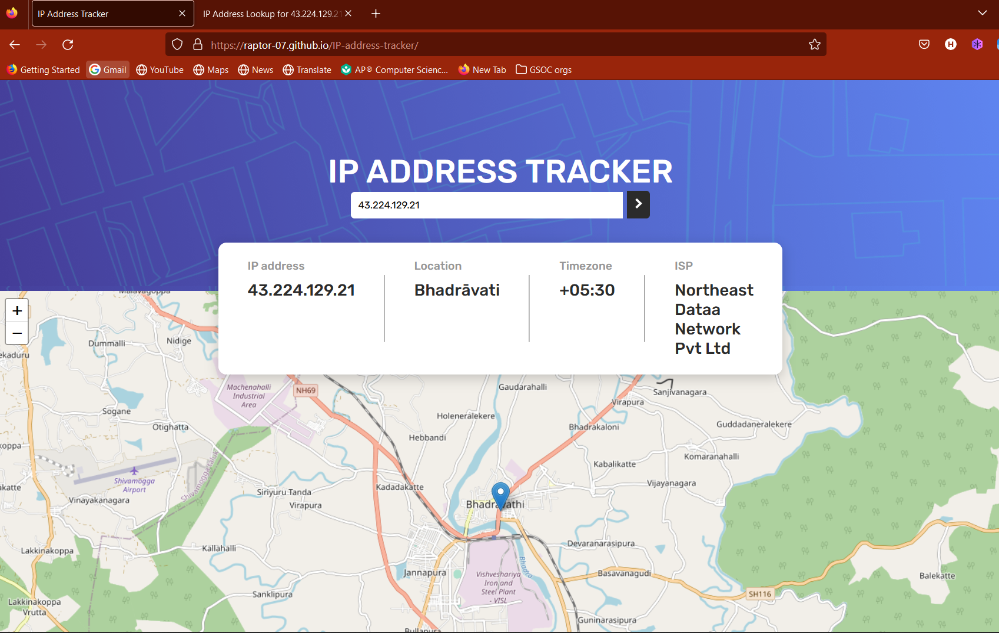
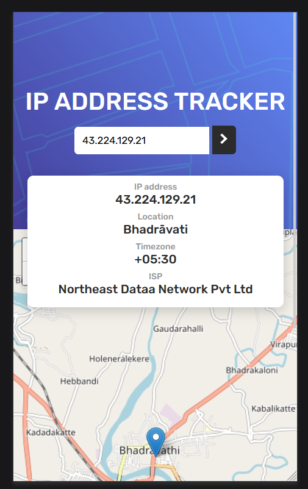

# IP Address Tracker #️⃣🤔

This project is a solution to the [IP Address Tracker challenge](https://www.frontendmentor.io/challenges/ip-address-tracker-I8-0yYAH0) on Frontend Mentor. The goal is to build an IP Address Tracker app that closely resembles the given design and utilizes the IP Geolocation API by IPify and LeafletJS for map generation.
**This project is live on [Github Pages](https://raptor-07.github.io/IP-address-tracker/)**

## Project Explanation

The application follows a traditional client-side MVC architecture. It fetches locational data of the IP address from the [IP Geolocation API by IPify](https://geo.ipify.org/). Once the data is fetched, a request is sent to the [Leaflet API](https://leafletjs.com/) to load map tiles and render them dynamically on the client-side.

### Features

- User can search for any IP address or domain
- Display IP address, location, timezone, and ISP information
- Interactive map showing location of the searched IP address or domain

## Tech Stack

- HTML
- CSS
- JavaScript

## Screenshots

### Getting Started

1. Clone this repository:

git clone https://github.com/yourusername/ip-address-tracker.git

2. Change into the project directory:

cd ip-address-tracker

3. Open `index.html` in your browser to see the application in action.

**Enjoy tracking IP addresses! 🚀😎**
